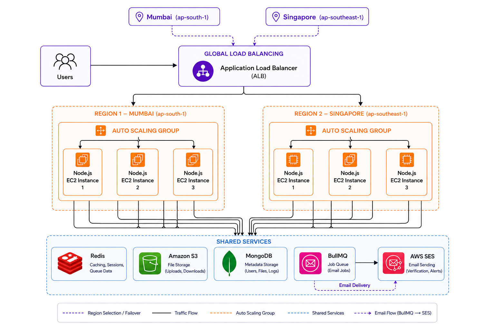

# ShareFlow

**Distributed cloud storage and file-sharing platform** with a decoupled control/data/async plane architecture — direct-to-S3 uploads, token-family JWT rotation, and background job processing via BullMQ.

Built with React 19, Express 5, MongoDB, Redis, BullMQ, and AWS (S3, SES, ALB, ASG, ESG).

---

## Table of Contents

- [Overview](#overview)
- [Key Features](#key-features)
- [Architecture](#architecture)
- [Core Pipelines](#core-pipelines)
- [Database Schema](#database-schema)
- [Tech Stack](#tech-stack)
- [Getting Started](#getting-started)
- [API Reference](#api-reference)
- [Project Structure](#project-structure)
- [License](#license)

---

## Overview

ShareFlow splits the system into three layers so the API server never becomes a bottleneck for file I/O.

| Layer | Responsibility | Technology |
|---|---|---|
| **Control Layer** | AuthN/AuthZ, metadata persistence, quota enforcement, permission resolution, presigned URL issuance | Node.js / Express API cluster |
| **Storage Layer** | High-throughput binary upload/download, streamed directly between client and object storage | AWS S3 (presigned URLs) |
| **Background Layer** | Decoupled async work — email dispatch, batch garbage collection, cleanup jobs | Redis + BullMQ |

The API never touches raw file bytes — it just issues short-lived, scoped credentials (presigned S3 URLs). So the control layer's compute and memory footprint stays constant regardless of file size: a 5 MB upload and a 5 GB upload cost it the same thing — one signed-URL call.

## Key Features

- **Direct-to-S3 uploads** via presigned URLs — zero server-side buffering, no RAM bottleneck
- **Token Family JWT rotation** with Redis-backed replay detection — a stolen refresh token gets the entire session family revoked
- **Async job processing** (BullMQ) for OTP email delivery and cascading folder/S3 cleanup, off the request path
- **Soft-delete trash bin** with batched S3 garbage collection (1,000 keys/chunk)
- **Public share links** with revocable, token-based unauthenticated access
- **Horizontally scalable** behind an ALB + Auto Scaling Group, stateless API tier

## Architecture



ShareFlow runs **active-active across two AWS regions** — Mumbai (`ap-south-1`) and Singapore (`ap-southeast-1`) — with a shared services layer both regions read and write to.

- **Global load balancing** — user traffic hits a global Application Load Balancer, which selects a region (with failover) and forwards to that region's target group.
- **Per-region Auto Scaling Groups** — each region runs its own ASG of Node.js/Express EC2 instances (3 shown per region), scaling independently on load.
- **Shared services** — both regions talk to the same backing services, so state is consistent regardless of which region serves a request:
  - **Redis** — caching, sessions, and BullMQ queue data.
  - **Amazon S3** — file storage for uploads/downloads.
  - **MongoDB** — metadata storage (users, files, logs).
  - **BullMQ → AWS SES** — queued jobs are processed and handed off to SES for verification/alert emails.
- **Async workers** — the email worker consumes `email-queue` and dispatches via SES; the folder-cleanup worker consumes `folder-cleanup-queue`, batch-deletes S3 objects, and cascades DB cleanup.

## Core Pipelines

### 1. Direct client-to-S3 presigned upload

```
Client                    Express API                MongoDB          S3
  │  POST /file/presigned-url │                          │              │
  ├───────────────────────────►  check quota (≤ 1GB)      │              │
  │                            ├──────────────────────────►              │
  │                            │  generate signed PUT URL (15m TTL)      │
  │                            ├─────────────────────────────────────────►
  │  ◄── presigned PUT URL ────┤                          │              │
  │  PUT binary ─────────────────────────────────────────────────────────►
  │  POST /file/confirm-upload │                          │              │
  ├───────────────────────────►  insert file doc, incr. usedStorage      │
  │                            ├──────────────────────────►              │
```

1. Client sends file metadata (`filename`, `mimeType`, `size`, optional `folderId`) to `POST /api/v1/file/presigned-url`.
2. Server validates `usedStorage + size ≤ storageLimit` (1 GB) and mints a 15-minute presigned S3 PUT URL, keyed as `uploads/<userId>/<timestamp>-<sanitizedName>`.
3. Client streams the binary payload directly to S3 — the Node event loop is never involved.
4. Client confirms via `POST /api/v1/file/confirm-upload`; server persists the file document and atomically increments quota.

### 2. Presigned download & preview resolution

S3 objects stay private. On file view/download, the server mints a 1-hour presigned GET URL with a `Content-Disposition` tuned to intent:
- **Preview** → `inline; filename="file.ext"` (in-browser modal viewer)
- **Download** → `attachment; filename="file.ext"` (forces download)

### 3. JWT authentication & token family rotation

- **Access tokens** are short-lived and held in-memory on the client only — never persisted, to blunt XSS exfiltration.
- **Refresh tokens** live in `httpOnly`, `SameSite=Strict` cookies.
- Each refresh token carries a `jti` and `familyId`; Redis tracks the valid `jti` per family (`refresh_token:<userId>:<familyId>`).
- A mismatched `jti` on refresh is treated as a replay attack — the entire token family is revoked immediately, forcing re-authentication everywhere it's in use.

### 4. Async job queues (BullMQ)

- `email-queue` — OTP dispatch via SES, 3 attempts with exponential backoff, decoupled from the registration request.
- `folder-cleanup-queue` — recursive folder deletion, batched `DeleteObjectsCommand` calls (≤1,000 keys/chunk), plus DB record and quota cleanup.

### 5. Soft-delete & garbage collection

- Deleting a file/folder sets `isDeleted: true` + `deletedAt` (reversible via restore).
- Permanent delete / "Empty Trash" queues background S3 deletion and removes DB records.

### 6. Public share links

- Toggle sharing via `PATCH /api/v1/share/file/:id/toggle`, which issues a 24-char hex `shareToken`.
- Unauthenticated guests resolve it at `GET /api/v1/share/access/:shareToken`.

## Database Schema

```
┌────────────────────────────────┐       ┌────────────────────────────────┐
│             USERS              │       │            FOLDERS             │
├────────────────────────────────┤       ├────────────────────────────────┤
│ _id: ObjectId                  │1     *│ _id: ObjectId                  │
│ name: String                   │───────│ name: String                   │
│ email: String (Unique, Indexed)│       │ user: ObjectId (Ref: Users)    │
│ password: String (Argon2id)    │       │ isDeleted: Boolean              │
│ usedStorage: Number            │       │ deletedAt: Date                │
│ storageLimit: Number (1GB)     │       │ createdAt / updatedAt: Date    │
│ isVerified: Boolean            │       └────────────────────────────────┘
│ avatar: String                 │                       │ 1
└────────────────────────────────┘                       │
                │ 1                                       │ *
                │ *                       ┌────────────────────────────────┐
                ▼                         │             FILES              │
┌────────────────────────────────┐        ├────────────────────────────────┤
│             SHARES              │       │ _id: ObjectId                  │
├────────────────────────────────┤        │ user: ObjectId (Ref: Users)    │
│ _id: ObjectId                   │       │ folder: ObjectId (Ref: Folder) │
│ shareToken: String (Unique)     │       │ originalName: String           │
│ resourceType: "file" | "folder" │       │ key: String (S3 Object Key)    │
│ file: ObjectId (Ref: File)      │       │ size: Number (Bytes)           │
│ folder: ObjectId (Ref: Folder)  │       │ mimeType / extension: String   │
│ owner: ObjectId (Ref: Users)    │       │ isDeleted / deletedAt: Date    │
│ isRevoked: Boolean              │       │ isShareable: Boolean           │
└────────────────────────────────┘        │ shareToken: String (Indexed)   │
                                           └────────────────────────────────┘
```

**Compound indexes**

| Collection | Index |
|---|---|
| Folder | `{ user: 1, isDeleted: 1, createdAt: -1 }` |
| File | `{ user: 1, folder: 1, isDeleted: 1 }` |
| File | `{ user: 1, isDeleted: 1, createdAt: -1 }` |
| File | `{ isDeleted: 1, deletedAt: 1 }` |
| Share | `{ shareToken: 1 }`, `{ owner: 1, createdAt: -1 }` |

## Tech Stack

**Frontend**
React 19 · Vite 8 · React Router DOM 7 · TanStack React Query 5 · Tailwind CSS 4 · Axios (with refresh-token interceptor queue) · React Hook Form + Zod · Zustand · Lucide React

**Backend**
Node.js (ESM) · Express 5 · Mongoose 9 · ioredis 6 · BullMQ 6 · Argon2 · JSONWebToken · Helmet · Express Rate Limit · Zod · Multer 2 (memory storage) · Morgan

**Cloud & Infrastructure**
AWS S3 (`@aws-sdk/client-s3`, presigner) · AWS SESv2 + Nodemailer · Application Load Balancer + Auto Scaling Group · Multi-AZ EC2

## Getting Started

### Prerequisites

| Requirement | Version | Notes |
|---|---|---|
| Node.js | 18+ (LTS) | ESM + native fetch |
| npm / pnpm | 9+ | Package manager |
| MongoDB | 6+ | Local or Atlas |
| Redis | 6+ | Local or Redis Cloud |
| AWS account | — | S3 bucket with CORS, verified SES sender |

### 1. Clone

```bash
git clone https://github.com/Manuacharya55/Distributed_File_Sharing_System.git
cd "Distributed File System"
```

### 2. Backend

```bash
cd server
npm install
```

Create `server/.env`:

```env
PORT=4000
NODE_ENV=development

MONGODB_URI=mongodb://localhost:27017/distributed-file-system
REDIS_URL=redis://127.0.0.1:6379

ACCESS_TOKEN_SECRET=your_jwt_access_secret_key_here
REFRESH_TOKEN_SECRET=your_jwt_refresh_secret_key_here

AWS_ACCESS_KEY_ID=your_aws_access_key_id
AWS_SECRET_ACCESS_KEY=your_aws_secret_access_key
AWS_REGION=ap-south-1
AWS_BUCKET_NAME=your_s3_bucket_name

AWS_SES_REGION=ap-south-1
EMAIL=your_verified_ses_sender_email@domain.com
```

```bash
npm run dev
```

Starts the API and BullMQ workers on `http://localhost:4000`.

### 3. Frontend

```bash
cd ../client
npm install
```

Create `client/.env`:

```env
VITE_BASE_URL=http://localhost:4000/api/v1
```

```bash
npm run dev
```

Serves the SPA at `http://localhost:5173`.

### Running everything

| Component | Default URL | Command |
|---|---|---|
| MongoDB | `mongodb://localhost:27017` | `mongod` |
| Redis | `redis://127.0.0.1:6379` | `redis-server` |
| Backend API | `http://localhost:4000` | `npm run dev` (in `/server`) |
| Frontend SPA | `http://localhost:5173` | `npm run dev` (in `/client`) |

## API Reference

### Auth — `/api/v1/auth`

| Method | Endpoint | Description |
|---|---|---|
| POST | `/register` | Register, hash password (Argon2id), queue OTP |
| POST | `/login` | Authenticate; return in-memory access token, set refresh cookie |
| POST | `/logout` | Revoke Redis token family, clear cookies |
| POST | `/verify-email` | Validate 6-digit OTP |
| GET | `/refresh-token` | Rotate token family, detect reuse, issue new access token |

### User — `/api/v1/user`

| Method | Endpoint | Description |
|---|---|---|
| GET | `/profile` | Get profile + storage stats |
| PATCH | `/profile` | Update name/email |
| PATCH | `/password` | Change password |
| PATCH | `/update-avatar` | Upload avatar to S3 |

### Files — `/api/v1/file`

| Method | Endpoint | Description |
|---|---|---|
| POST | `/presigned-url` | Validate quota, return 15-min S3 PUT URL |
| POST | `/confirm-upload` | Persist metadata, increment quota |
| GET | `/` | List files (search, folder filter, pagination) |
| GET | `/:id` | Get metadata + 1-hour presigned preview/download URLs |
| DELETE | `/:id` | Soft-delete (move to Trash) |
| PATCH | `/:id/restore` | Restore from Trash |
| DELETE | `/:id/permanent` | Permanently delete from S3 + MongoDB |

### Folders & Trash — `/api/v1/folder`

| Method | Endpoint | Description |
|---|---|---|
| POST | `/` | Create folder |
| GET | `/` | List folders (paginated) |
| GET | `/:id` | Folder details + nested files |
| PATCH | `/:id` | Rename folder |
| DELETE | `/:id` | Soft-delete + cascading cleanup worker |
| GET | `/trash` | List soft-deleted items |
| DELETE | `/trash/empty` | Empty trash, batch S3 deletion |

### Share Links — `/api/v1/share`

| Method | Endpoint | Description |
|---|---|---|
| PATCH | `/file/:id/toggle` | Toggle public sharing, create `shareToken` |
| GET | `/access/:shareToken` | Public preview/download for guests |

### Dashboard — `/api/v1/dashboard`

| Method | Endpoint | Description |
|---|---|---|
| GET | `/` | Totals, file-type breakdown, used storage, recent activity |

### Health

| Method | Endpoint | Description |
|---|---|---|
| GET | `/health` | Liveness probe |

## Project Structure

<details>
<summary><strong>Client</strong></summary>

```
client/
├── public/
├── src/
│   ├── api/
│   │   └── api.js                  # Axios instance, JWT interceptor, refresh lock, S3 PUT helper
│   ├── components/
│   │   ├── headers/                # NavBar, Footer
│   │   ├── layout/
│   │   │   └── ProtectedLayout.jsx # Route guard (in-memory JWT)
│   │   └── shared/                 # Button, ConfirmModal, EmptyState, ErrorState,
│   │                                # ImageComponent (multi-file + direct S3 upload),
│   │                                # InputField, Loader, Pagination
│   ├── context/
│   │   ├── AuthContext.jsx
│   │   └── ToastContext.jsx
│   ├── features/
│   │   ├── auth/                   # Login, register, OTP verification
│   │   ├── dashboard/               # Metrics, storage gauge, recent activity
│   │   ├── files/                   # Lists, search, preview modal, share modal
│   │   ├── folders/                  # Hierarchical view, create/rename modals
│   │   ├── profile/                  # Profile edit, password change, avatar upload
│   │   ├── share/                    # Guest preview/download view
│   │   ├── trash/                    # Soft-delete manager
│   │   └── NotFound.jsx
│   ├── utils/
│   │   ├── downloadFile.js
│   │   └── formErrors.js
│   ├── App.jsx
│   ├── index.css
│   ├── main.jsx
│   └── vite.config.js
├── .env
└── package.json
```
</details>

<details>
<summary><strong>Server</strong></summary>

```
server/
├── src/
│   ├── app.js                       # Express init, rate limiter, security headers, routers
│   ├── index.js                     # Bootstrap, DB connection, HTTP listener
│   ├── config/aws.js                # S3 client singleton
│   ├── controllers/                 # auth, dashboard, file, folder, share, user
│   ├── db/index.js                  # Mongoose connection handler
│   ├── middlewares/                 # auth, multer, zod validation
│   ├── models/                      # file, folder, share, user
│   ├── redis/
│   │   ├── connection.js
│   │   ├── queue.js / worker.js               # email-queue
│   │   └── folderCleanup.queue.js / .worker.js
│   ├── routes/                      # auth, dashboard, file, folder, share, user
│   ├── schema/                      # zod schemas
│   ├── services/email.service.js
│   ├── templates/otp.template.js
│   └── utils/                       # ApiError, ApiSuccess, argon, asyncHandler,
│                                     # aws, email, globalError, JWT, logger,
│                                     # multer, pagination, s3.helper, validate
├── .env
└── package.json
```
</details>
